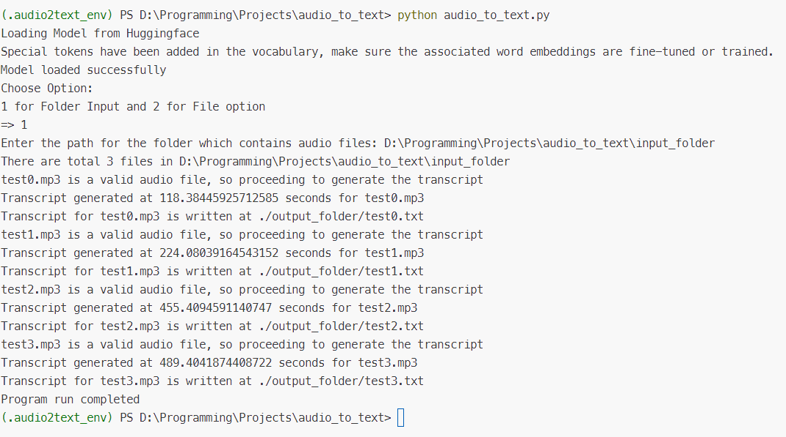
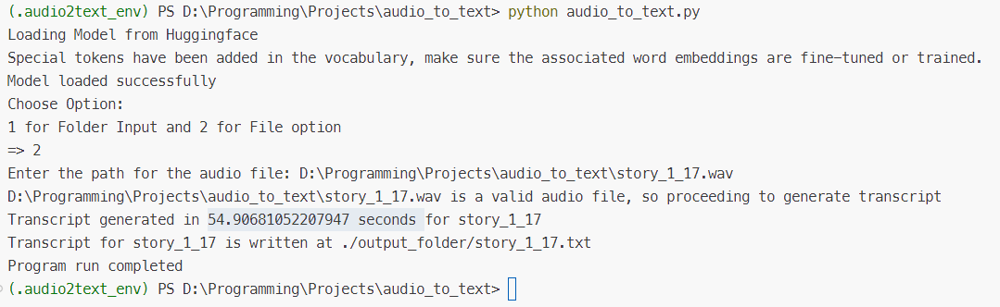

# Nepali Audio To Text
- This is a system capable of generating Nepali transcripts for the Nepali speech input. This system uses the Nepali ASR model [wav2vec2-nepali](https://huggingface.co/anish-shilpakar/wav2vec2-nepali) which is a fine-tuned version of Facebook's wav2vec2 model for Nepali dataset
- This system is a small part of [SwarSaransha](https://github.com/JuJu2181/Automatic-Nepali-Speech-Recognition-and-Summarizer)
- **Developed By:** [Anish Shilpakar](https://github.com/JuJu2181)
- Web Interface for this system will be created soon. Stay tuned.

## Steps to configure this system
### 1. Clone this repository
```
https://github.com/JuJu2181/NepaliAudio2Text
```
### 2. Install requirements.txt  
- As I used Python 3.8.5 for this project, it is recommended to use the same Python version to avoid any errors
> Note: It is suggested to create a virtual environment before installing these requirements
```
pip install -r requirements.txt
```
### 3. Run the project
```
python audio_to_text.py
```

## Output:
Here you have 2 options either to convert all the audio files in a folder to their transcripts or simply convert a single audio file to its transcript. And the output for both these modes are shown below:
### 1. Generating Transcript for Folder of Audio files

### 2. Generating Transcript for a single audio file
